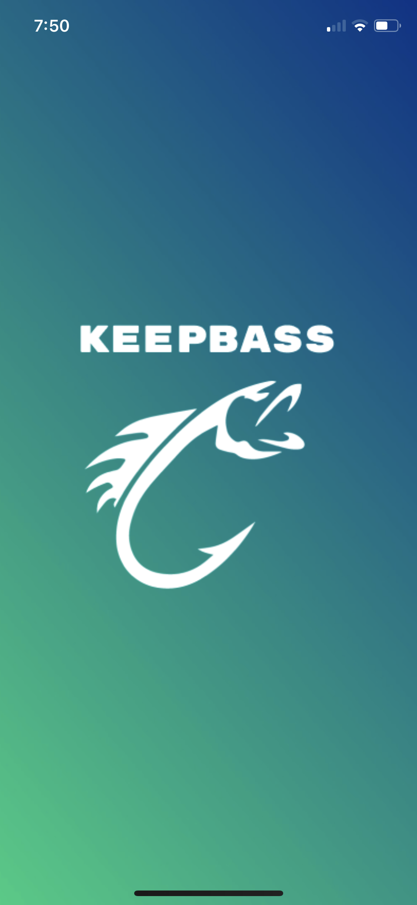
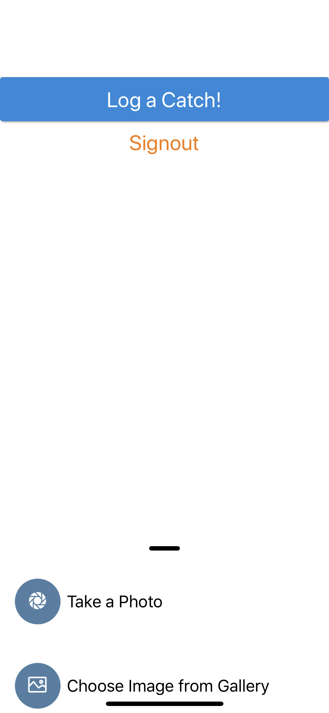
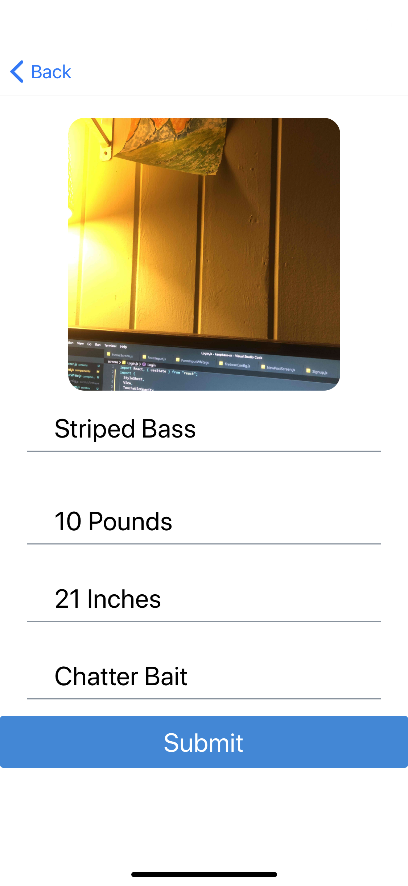
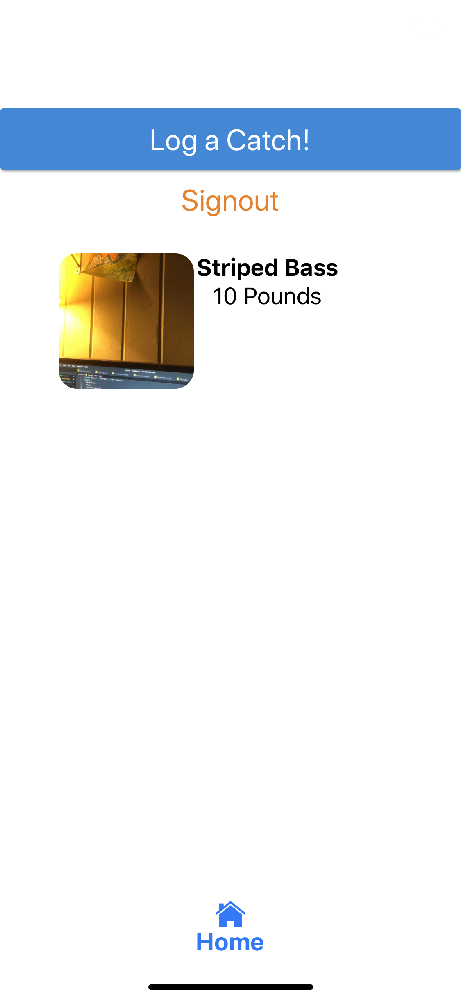

# Keep Bass 🐟

  <!-- iOS -->
  
  <!-- Android -->
    

An app I built that allows you to keep track of fish you have caught. Here you can take a picture of the fish, add stats, and view previous catches.

       

## Installation

- Clone this repo
- to install dependencies: `npm install` or `yarn install`
- rename `.example.env` to `.env` and update with your firebase config.

**Happy Coding!** 🎉🎉
